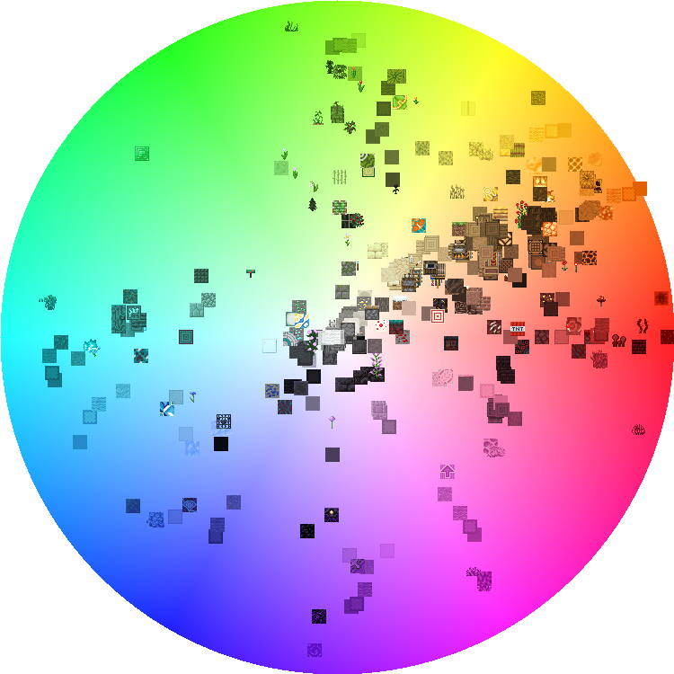

# BlockColours
A Processing project that plots the average colour of various Minecraft blocks on a colour wheel.

## Installation
1. Download [Processing](https://processing.org/download/);
2. **Rename `/BlockColours-master/` to `/BlockColours/`**;
3. Run `BlockColours.pde`.

## Result

